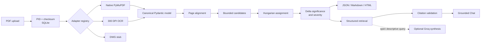

# Architecture

Deterministic code performs extraction, OCR, engineering-value parsing, normalization, candidate rejection, numeric comparison, spatial comparison, assignment, significance, severity, structured retrieval, reporting, and citation validation. The default mock mode works without an API key. Groq is used only for open descriptive prose after evidence has been selected; broad summaries and page/value/entity filters remain deterministic.

Candidate admission rejects dimension-to-text pairs, conflicting identifiers, unrelated low-overlap text, and ambiguous short tokens before assignment. Punctuation, list numbering, and likely OCR noise are retained in diagnostic collections rather than shown as meaningful deltas.

Each comparison and chat writes a JSON trace. `/metrics` exposes local Prometheus text metrics.
